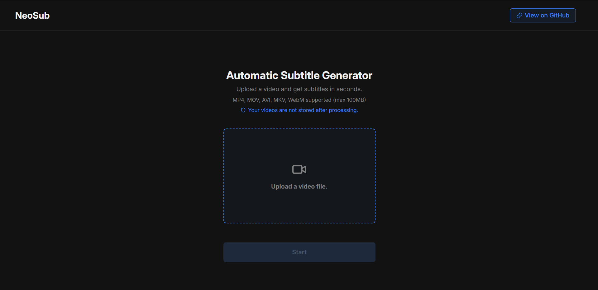

# NeoSub

A simple subtitles generator for videos that uses whisper-ai.

## Tech Stack

- Django Rest Framework (Backend)
- React (Frontend)
- Celery (Background Task)
- Redis (Task Broker)

## What I Learned While Building It

- Celery
- Docker
- UUID primary key

## Prerequisites

- Docker & Docker Compose
- Node.js

## How to Run Locally

1. Create a `.env` file in the frontend directory (see `.env.example`)
2. Run `docker compose up --build`
3. Navigate to `frontend` and run `npm install`
4. Run `npm run dev`
